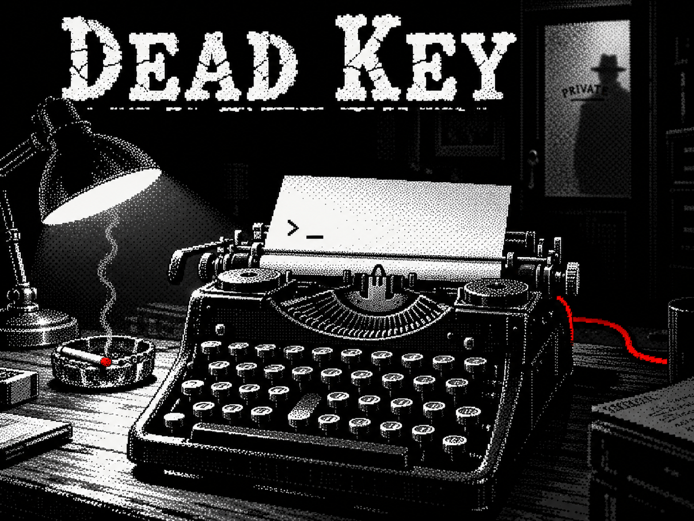

# DEAD KEY

*A 1930s noir puzzle game. One room. One word. Fifteen minutes.*



You wake up at your desk in your detective's office. You can't move. You can't speak.
A red cable runs from your typewriter across the floor and under the locked door.
Someone on the other side types a message onto your paper:

> GOOD EVENING, DETECTIVE.
> YOU WERE POISONED AN HOUR AGO.
> ONE WORD IS HIDDEN IN THIS ROOM.
> TYPE IT AND YOU LIVE.

**▶ Play it here: https://rblackwood224.github.io/DeadKey/**

---

## How to play

- **Search the room.** Click (or tap) the objects: the newspaper, the drawers, the coat pockets, the books, the telephone, the window… Some things have to be opened first.
- **Crack the pieces.** The word is split into pieces, and every piece is hidden in a different way:
  - a note typed by shaking hands, every key shifted on the keyboard
  - Morse code blinking from a neon sign, a lamp, a radio or knocking in the pipes
  - numbers from an old telephone dial
  - numbers that are really letters (A = 1… or the other way round)
  - a book code: line and letter on a dog-eared page
  - mirror writing
- **Put them in order.** Small marks (Roman numerals or dots) tell you the order of the pieces.
- **Don't trust everyone.** One or two pieces come from a liar. Your own notebook may warn you about who it is.
- **Type the word** on the typewriter and press Enter. Every wrong answer makes the poison spread faster.
- **Watch the time without a timer.** The wall clock runs backwards, and the cigarette in the ashtray burns down while you think.

There is no hint about the length of the word, and every room is different: the word, the furniture, where the pieces are hidden, the keys you need and even the weather. You can't learn the rooms by heart, you have to think.

## Game modes

| Mode | |
|---|---|
| **Wake up** | Alone, 15 minutes |
| **Hard** | Alone, 10 minutes, more pieces and two liars |
| **Room of the day** | The same room for everyone today: compare your times |
| **Series** | Three rooms in a row, leftover time carries over, and the truth at the end |
| **Online: versus** | Up to 4 players, same word, same room. When someone solves it, everyone else's clock runs faster |
| **Online: co-op** | Up to 4 players in the same room. Everyone sees different clues, only the host can type, so you have to talk |

Online games work like this: the host creates a room and sends the link to friends.

## Controls

- **Mouse / touch:** click objects to look closer
- **Keyboard:** type on your own keyboard, Enter to send, Backspace to delete
- **Phone:** tap the paper to bring up the keyboard
- **Gamepad:** left stick moves a cursor, A looks closer, B puts it back

Languages: **English, Magyar, Français**.

## Running it on your computer

Download the files and open `index.html` in a browser. Everything works, with two small differences: the recorded sound effects are replaced by simple generated sounds, and online play needs an internet connection.

## Files

```
index.html, script.js, style.css   the game
title.png                          title screen
room1.png … room5.png              painted offices
assets/rooms/                      empty offices for the built rooms
assets/wall/ furniture/ desk/      objects placed at random in the built rooms
assets/props/                      typewriter, lamp, telephone
assets/cigarette/                  the six burning phases of the cigarette
assets/hotel/                      the HOTEL neon sign
sounds/                            music and sound effects
```

---

## Magyarul röviden

Egy 1930-as évekbeli noir rejtvényjáték. Az irodádban ébredsz, megmérgeztek, és 15 perced van, hogy megtaláld a szobában elrejtett szót. A szó darabokra van szedve, minden darab másképp van elkódolva, és az egyik hazudik. Minden szoba más, nem lehet kitanulni. Játszható egyedül, a nap szobájaként, sorozatban, és online akár négyen, egymás ellen vagy együtt.

---

**DEAD KEY** · a noir puzzle game by **Richie** · 2026
